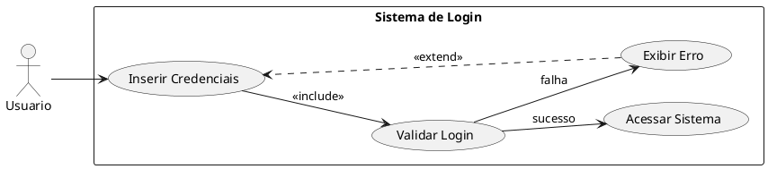
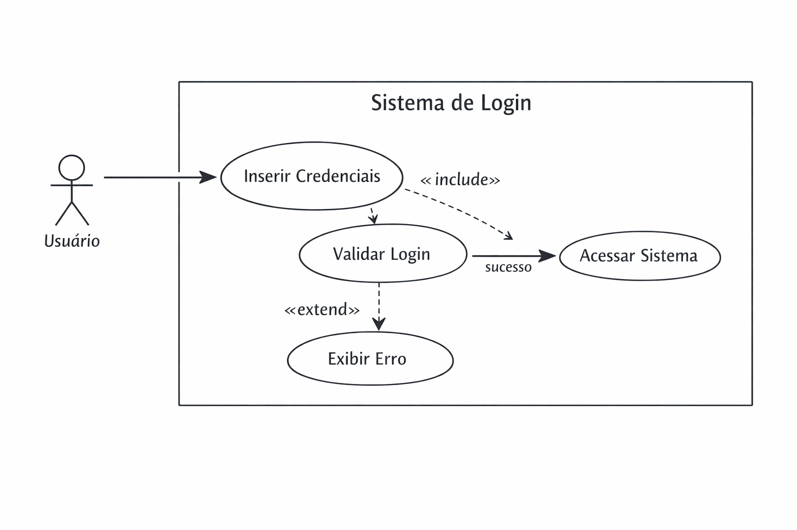

# Introdução à UML

## Diagrama de Caso de Uso

---

## 🎯 Objetivos da Aula

Ao final da aula, o aluno será capaz de:

* Compreender o conceito de UML e sua importância
* Identificar os elementos de um Diagrama de Caso de Uso
* Diferenciar atores, casos de uso e relacionamentos
* Aplicar include e extend corretamente
* Criar diagramas simples para sistemas reais

---

## 📌 O que é UML?

**UML (Unified Modeling Language)** é uma linguagem padrão utilizada para **modelar sistemas de software**.

💡 Ela não é uma linguagem de programação, mas sim uma forma de **desenhar e planejar sistemas** antes de implementá-los.

### 🧠 Analogia:

Imagine que você vai construir uma casa:

* Você não começa construindo direto
* Primeiro faz a planta

👉 UML é a “planta” do software

---

## 🎯 Por que usar UML?

* Facilita o entendimento entre desenvolvedores e clientes
* Evita erros antes da implementação
* Ajuda na documentação do sistema
* Organiza ideias complexas

💡 Muito usada em análise de requisitos

---

## 📊 Tipos de Diagramas UML

A UML possui vários diagramas, cada um com um objetivo:

* **Caso de Uso** → o que o sistema faz
* **Classe** → estrutura do sistema
* **Sequência** → ordem das interações
* **Atividade** → fluxo de processos

👉 Nesta aula: foco no **Diagrama de Caso de Uso**

---

## 🧩 O que é um Diagrama de Caso de Uso?

É um diagrama que representa **as funcionalidades do sistema do ponto de vista do usuário**.

### 📌 Importante:

* NÃO mostra código
* NÃO mostra banco de dados
* NÃO mostra detalhes técnicos

👉 Mostra apenas:
✔ Quem usa o sistema
✔ O que o sistema faz

---

## 👤 Atores

Atores representam **quem interage com o sistema**

### Podem ser:

* Pessoas (usuário, cliente, administrador)
* Sistemas externos (API de pagamento, outro sistema)

### 🧠 Regra importante:

> O ator está fora do sistema

---

## 🎭 Exemplos de Atores

* Cliente (compra produtos)
* Administrador (gerencia sistema)
* Sistema de Pagamento (processa transações)
* Entregador (realiza entrega)

💡 Um mesmo sistema pode ter vários atores

---

## ⚙️ Casos de Uso

Casos de uso representam **funcionalidades do sistema**

### 📌 Sempre:

* Começam com verbo
* Representam uma ação

### Exemplos:

* Fazer login
* Comprar produto
* Gerar relatório
* Cadastrar usuário

---

## 🧠 Dica importante

Se você consegue responder:

👉 “O que o usuário consegue fazer no sistema?”

Isso provavelmente é um **caso de uso**

---

## 🔗 Relacionamentos

Relacionamentos mostram **como os elementos se conectam**

Tipos principais:

* Associação
* Include
* Extend

---

## 🔹 Associação

É a ligação básica entre ator e caso de uso

### 📌 Representação:

Linha simples

### 🧠 Significado:

O ator participa daquela ação

### Exemplo:

Cliente → Comprar Produto

---

## 🔁 Include (Inclusão)

Usado quando um caso de uso **sempre depende de outro**

### 📌 Características:

* Execução obrigatória
* Reutilização de comportamento
* Evita repetição

### 🧠 Analogia:

Toda compra precisa validar pagamento

👉 Não existe compra sem pagamento

---

### 📌 Exemplo:

* Comprar Produto
  ⮕ inclui → Validar Pagamento

---

## 🔀 Extend (Extensão)

Usado quando um comportamento é **opcional**

### 📌 Características:

* Executado em situações específicas
* Não acontece sempre
* Representa variações

---

### 🧠 Analogia:

Aplicar desconto só acontece:

* Se houver cupom
* Se cliente for VIP

👉 Nem sempre ocorre

---

### 📌 Exemplo:

* Comprar Produto
  ⮕ extend → Aplicar Desconto

---

## ⚖️ Diferença Include vs Extend

| Include           | Extend              |
| ----------------- | ------------------- |
| Sempre acontece   | Opcional            |
| Parte obrigatória | Comportamento extra |
| Reutilização      | Variação            |
| Fluxo principal   | Fluxo alternativo   |

---

## 🧠 Exemplo Simples

Sistema de Loja:

### 👤 Ator:

* Cliente

### ⚙️ Casos de Uso:

* Fazer login
* Comprar produto
* Pagar

---
### 🔗 Relações:

* Comprar → include → Pagar
* Comprar → extend → Aplicar Cupom

---

# 🔐 Exemplo Completo: Sistema de Login

## 🎯 Cenário

Um sistema onde o usuário precisa se autenticar para acessar funcionalidades

## 👤 Ator

* Usuário

---

## ⚙️ Casos de Uso

* Inserir credenciais
* Validar login
* Acessar sistema
* Exibir erro

---

## 🧾 Código PlantUML

---

---

## 🧠 Explicação Detalhada

### 1. Fluxo principal:

* Usuário insere credenciais
* Sistema valida login (include → obrigatório)

### 2. Possíveis resultados:

✔ Sucesso:

* Usuário acessa o sistema

❌ Falha:

* Sistema exibe erro

---

### 🔁 Extend aplicado:

Após erro:

* Usuário pode tentar novamente

👉 Isso é opcional → por isso usamos **extend**

---

## ▶️ Como Executar

Ferramentas:

* Site oficial do PlantUML
* VS Code (extensão PlantUML)
* IntelliJ / Eclipse

---

## ✍️ Boas Práticas

✔ Use nomes claros
✔ Evite termos técnicos demais
✔ Foque no usuário
✔ Mantenha diagramas simples

---

## 🚫 Erros Comuns

* Misturar lógica de programação
* Criar casos muito detalhados
* Esquecer atores
* Usar include/extend incorretamente

---

## 🧪 Exercício Prático

### 🎯 Sistema de Biblioteca

Crie um diagrama com:

### 👤 Atores:

* Aluno
* Bibliotecário
---
### ⚙️ Casos:

* Buscar livro
* Emprestar livro
* Devolver livro
* Cadastrar livro

### 🔗 Relações:

* Emprestar → include → Verificar disponibilidade
* Emprestar → extend → Aplicar multa

---

## 📚 Conclusão

* UML ajuda a organizar ideias
* Caso de uso foca no comportamento do sistema
* Include = obrigatório
* Extend = opcional

👉 Dominar isso melhora sua modelagem de sistemas

---

## ❓ Perguntas?

