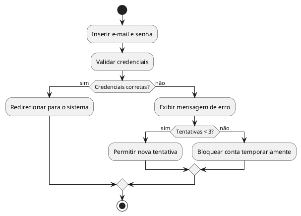
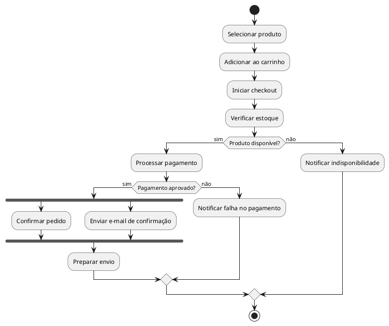
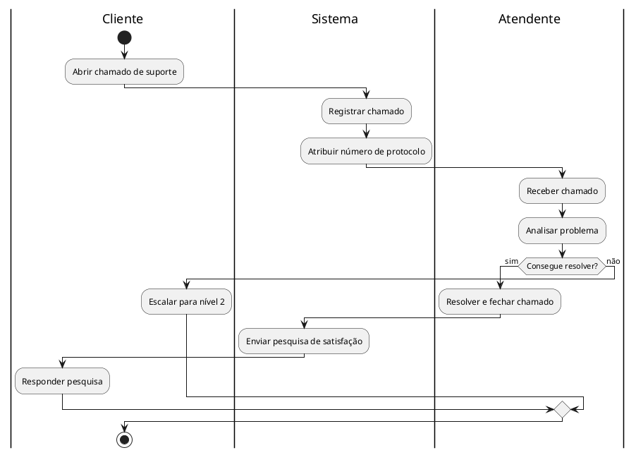
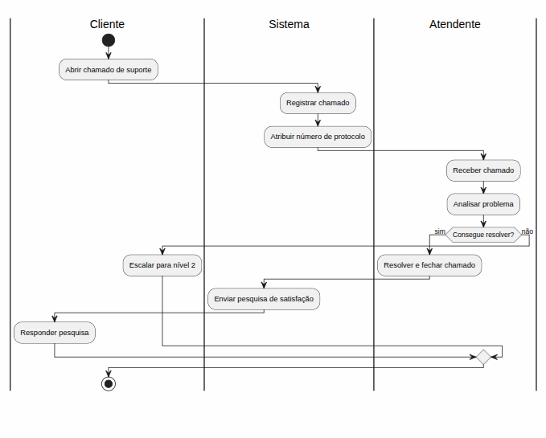

# Diagrama de Atividade

## UML — Modelando Fluxos e Processos

---

## 🎯 Objetivos da Aula

Ao final da aula, o aluno será capaz de:

- Compreender o que é o Diagrama de Atividade na UML
- Identificar os elementos principais do diagrama
- Diferenciar fluxos sequenciais, condicionais e paralelos
- Utilizar raias (swimlanes) para representar responsabilidades
- Criar diagramas de atividade para situações reais

---

## 📌 Recapitulando: Tipos de Diagramas UML

<style scoped>table { font-size: 0.75em; }</style>

| Diagrama      | Para que serve                 |
| ------------- | ------------------------------ |
| Caso de Uso   | O que o sistema faz            |
| Classe        | Estrutura do sistema           |
| Sequência     | Ordem das interações           |
| **Atividade** | **Fluxo de processos e ações** |

👉 Nesta aula: foco no **Diagrama de Atividade**

---

## 🔄 O que é o Diagrama de Atividade?

É um diagrama UML que representa o **fluxo de controle ou de dados** dentro de um sistema ou processo.

💡 Pense nele como um **fluxograma avançado** com suporte a:

- Condições (decisões)
- Ações paralelas
- Responsabilidades por participante (raias)

---

## 🧠 Analogia

Imagine uma receita de bolo:

1. Separar ingredientes
2. Misturar massa
3. **Se** o forno estiver quente → assar
4. **Senão** → pré-aquecer o forno → assar
5. Servir

👉 Esse fluxo é exatamente o que o Diagrama de Atividade modela!

---

## 🎯 Quando usar?

- Modelar processos de negócio (ex: fluxo de compra)
- Descrever algoritmos complexos
- Detalhar casos de uso com muitos passos
- Identificar pontos de decisão e paralelismo

---

## 🧩 Elementos do Diagrama de Atividade

---

<style scoped>table { font-size: 0.75em; }</style>

| Elemento             | Símbolo               | Descrição                           |
| -------------------- | --------------------- | ----------------------------------- |
| Nó Inicial           | ● (círculo cheio)     | Início do fluxo                     |
| Nó Final             | ⊙ (círculo com borda) | Fim do fluxo                        |
| Ação / Atividade     | Retângulo arredondado | Uma tarefa ou passo do processo     |
| Decisão (Desvio)     | ◇ (losango)           | Ponto de escolha — sim/não, if/else |
| Merge (Convergência) | ◇ (losango)           | Une caminhos alternativos           |
| Fork (Bifurcação)    | Barra horizontal      | Divide em fluxos paralelos          |
| Join (Sincronização) | Barra horizontal      | Sincroniza fluxos paralelos         |
| Raia (Swimlane)      | Coluna/faixa          | Representa responsável por ações    |

---

## ▶️ Nó Inicial e Nó Final

- **Nó Inicial** → ponto de partida do fluxo
  - Representado por: ● (círculo preto sólido)

- **Nó Final** → encerramento do fluxo
  - Representado por: ⊙ (círculo com borda dupla)

💡 Todo diagrama começa com um nó inicial e termina com um nó final.

---

## ⚙️ Ações e Atividades

São os **passos do processo**, representados por retângulos com cantos arredondados.

### Exemplos:

- "Inserir dados do usuário"
- "Validar formulário"
- "Salvar no banco de dados"
- "Enviar e-mail de confirmação"

📌 Cada ação deve ser escrita com **verbo no infinitivo**

---

## 🔀 Decisão e Merge

**Decisão** → o fluxo se divide em caminhos alternativos conforme uma condição

```
        ◇ [ senha correta? ]
       / \
    sim   não
     ↓     ↓
```

**Merge** → os caminhos alternativos se **unem novamente** em um único fluxo

---

## ⚡ Fork e Join (Fluxo Paralelo)

Alguns processos ocorrem **ao mesmo tempo**:

- **Fork** → divide o fluxo em dois ou mais caminhos paralelos
- **Join** → sincroniza os caminhos, esperando **todos** terminarem

### 🧠 Exemplo:

Ao confirmar um pedido:

- Enviar e-mail de confirmação **(paralelo)**
- Debitar pagamento **(paralelo)**
- ↓ só avança quando ambos terminarem

---

## 🏊 Raias (Swimlanes)

As raias dividem o diagrama mostrando **quem é responsável** por cada ação.

### Por que usar?

- Clareza sobre responsabilidades
- Útil em processos com múltiplos participantes
- Facilita identificar handoffs (passagem de responsabilidade)

### Exemplo de raias:

- Cliente | Sistema | Banco

---

## 📋 Exemplo 1: Fluxo de Login

### Cenário:

Usuário tenta acessar o sistema

### Fluxo:

1. Usuário insere e-mail e senha
2. Sistema valida as credenciais
3. **Se** credenciais corretas → acessa o sistema
4. **Se** credenciais incorretas → exibe mensagem de erro
5. Usuário pode tentar novamente (máximo 3 tentativas)

---

## 🧾 Código PlantUML — Login



---

## 📋 Exemplo 2: Processo de Compra Online

### Cenário:

Cliente realiza uma compra em e-commerce

### Fluxo:

1. Cliente seleciona produto
2. Adiciona ao carrinho
3. Inicia o checkout
4. Sistema verifica estoque
5. **Se** disponível → processa pagamento
6. **Se** indisponível → notifica o cliente
7. Pagamento aprovado → confirma pedido e envia e-mail

---

## 🧾 Código PlantUML — Compra Online



---

## 📋 Exemplo 3: Com Raias — Atendimento ao Cliente

### Participantes:

- Cliente
- Atendente
- Sistema

---

## 🧾 Código PlantUML — Raias


---


---

## ⚖️ Diagrama de Atividade vs Caso de Uso

<style scoped>table { font-size: 0.75em; }</style>

| Diagrama de Caso de Uso | Diagrama de Atividade        |
| ----------------------- | ---------------------------- |
| **O que** o sistema faz | **Como** o processo acontece |
| Foco em funcionalidades | Foco no fluxo de passos      |
| Mostra atores externos  | Mostra responsáveis (raias)  |
| Visão do cliente        | Visão do processo interno    |
| Não mostra sequência    | Mostra sequência e lógica    |

---

## ⚖️ Diagrama de Atividade vs Fluxograma

<style scoped>table { font-size: 0.75em; }</style>

| Fluxograma (tradicional) | Diagrama de Atividade (UML) |
| ------------------------ | --------------------------- |
| Sem padrão formal        | Padrão UML definido         |
| Não suporta paralelismo  | Suporta Fork/Join           |
| Sem raias por padrão     | Swimlanes nativas           |
| Uso geral                | Voltado para software       |

---

## ✍️ Boas Práticas

✔ Escreva ações com **verbos no infinitivo**: "Validar", "Enviar", "Salvar"
✔ Mantenha o diagrama **simples e legível**
✔ Use raias quando houver **mais de um responsável**
✔ Sempre defina **nó inicial e nó final**
✔ Use Fork/Join quando ações ocorrem **em paralelo**
✔ Evite diagramas com mais de **15-20 ações** — divida em subfluxos

---

## 🚫 Erros Comuns

- Misturar detalhes de código com o fluxo
- Esquecer o nó inicial ou o nó final
- Criar decisões sem todas as saídas rotuladas (sim/não)
- Usar Fork sem o Join correspondente
- Fazer diagramas grandes demais sem raias para organizar

---

## 🧪 Exercício Prático

### 🎯 Sistema de Matrícula Universitária

Crie um Diagrama de Atividade com o seguinte cenário:

**Participantes:** Aluno, Sistema, Secretaria

---

### 📋 Fluxo esperado:

1. Aluno seleciona as disciplinas desejadas
2. Sistema verifica se há vagas disponíveis
   - Se sim → verifica pendências financeiras do aluno
   - Se não → notifica o aluno sobre indisponibilidade
3. Se não há pendências → efetua a matrícula
4. Se há pendências → bloqueia a matrícula e notifica
5. Sistema envia comprovante de matrícula por e-mail
6. Secretaria confirma o registro

---

### 💡 Dica para o exercício:

- Identifique os **pontos de decisão** (losangos)
- Identifique as **raias** (aluno, sistema, secretaria)
- Verifique se existe algum **fluxo paralelo**

---

## 🔧 Ferramentas para Criar Diagramas de Atividade

<style scoped>table { font-size: 0.75em; }</style>

| Ferramenta | Tipo              | Link ou Acesso         |
| ---------- | ----------------- | ---------------------- |
| PlantUML   | Código (texto)    | plantuml.com           |
| draw.io    | Visual (arrastar) | app.diagrams.net       |
| Lucidchart | Visual (online)   | lucidchart.com         |
| VS Code    | Extensão PlantUML | Marketplace do VS Code |
| StarUML    | Desktop           | staruml.io             |

---

## 📚 Conclusão

- O Diagrama de Atividade modela **fluxos e processos**
- Possui elementos específicos: Ação, Decisão, Fork, Join, Raias
- É mais detalhado que o Caso de Uso em termos de **como** algo acontece
- Use **PlantUML** ou **draw.io** para criar seus diagramas
- Raias deixam claro **quem faz o quê** em processos complexos

👉 Dominar esse diagrama é essencial para modelar processos reais!

---

## ❓ Perguntas?
