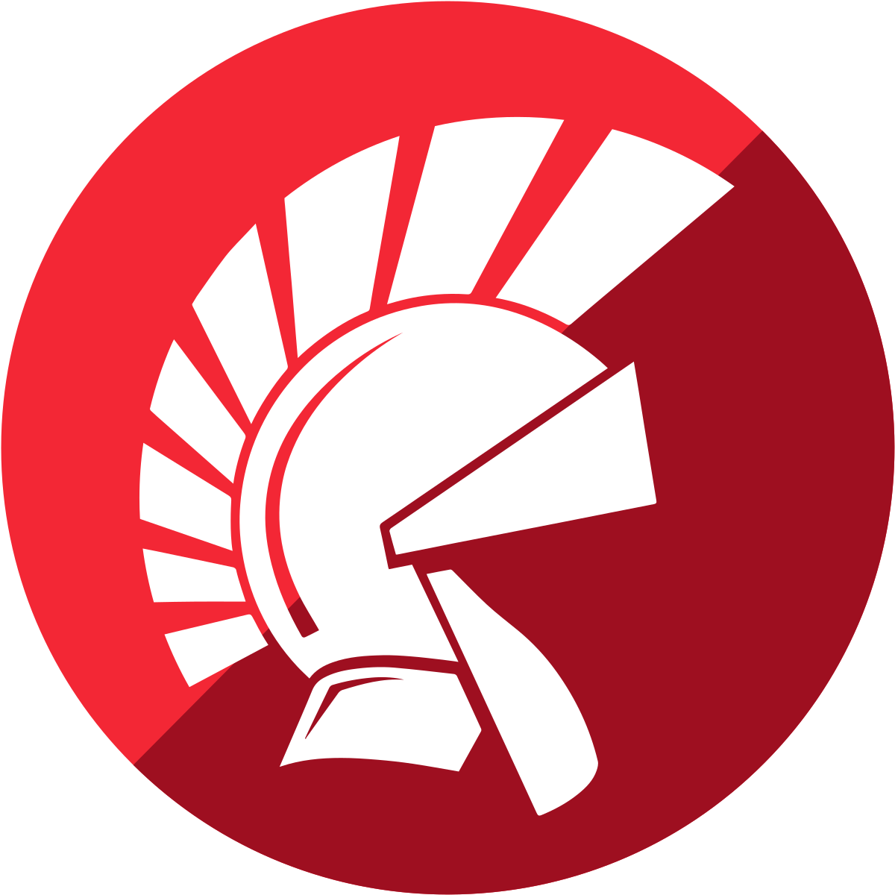

# Desenvolvimento Desktop

---

A programação desktop refere-se ao desenvolvimento de aplicativos que são executados diretamente em computadores locais, em oposição a aplicativos web que são acessados através de navegadores. Há várias linguagens e frameworks que podem ser usados para programação desktop, cada um com suas próprias características e vantagens.

---

<!-- _class: lead -->

# Vamos conhecer alguns deles

---

# Java:

**Swing e JavaFX:** Oferecem uma ampla variedade de componentes de interface do usuário para criar aplicações desktop em Java.

---

# C# (com .NET):

**Windows Forms e WPF:** Plataforma da Microsoft para desenvolver aplicativos Windows com uma interface gráfica rica.

---

# C++:

**Qt:** Um framework poderoso e multiplataforma que permite o desenvolvimento de aplicativos desktop com uma aparência nativa em diferentes sistemas operacionais.

---

# Python:

**Tkinter:** Uma biblioteca padrão para criar interfaces gráficas em aplicações Python.
**PyQt e PySide:** Wrappers para Qt, oferecendo poderosas opções de desenvolvimento em Python.

---

# Swift (para macOS):

Usado para desenvolver aplicativos nativos para o ecossistema da Apple, especialmente para o macOS.

---

# Kotlin (com JavaFX):

Kotlin é interoperável com Java e pode ser usado com JavaFX para o desenvolvimento de aplicativos desktop.

---

# Delphi (Object Pascal):

**VCL e FireMonkey:** Frameworks utilizados para desenvolver aplicações Windows nativas.

---

# Go (com Fyne):

**Fyne:** Uma biblioteca em Go para criar interfaces gráficas de usuário.

---

# Ruby:

**Shoes:** Uma biblioteca para criar interfaces gráficas de usuário em Ruby.

---
<!-- _class: lead -->

# E a estrela do momento ...
---

<!-- _class: lead -->

# Electron.js

---

## O que é Electron.js?

O Electron.js é um framework de código aberto que permite o desenvolvimento de aplicações multiplataforma usando tecnologias web comuns, como HTML, CSS e JavaScript. Ele oferece a capacidade de criar aplicações desktop robustas para Windows, macOS e Linux, tudo com um único código-base.

---

## Principais Características

###### Por que escolher Electron.js?

- **Multiplataforma:** Desenvolva uma vez, execute em qualquer lugar - Windows, macOS, e Linux.

- **Fácil Integração:** Integre facilmente bibliotecas e frameworks populares como React, Angular e Vue.js.

- **Rápido Desenvolvimento:** Acelere o desenvolvimento com ferramentas familiares da web.
- **Comunidade Ativa:** Beneficie-se de uma comunidade vasta e engajada.

---

## Como Funciona

##### Arquitetura do Electron.js

O Electron.js possui uma arquitetura baseada em dois processos principais: o processo principal e os processos de renderização. O processo principal gerencia a janela do aplicativo e interage com o sistema operacional, enquanto os processos de renderização lidam com a interface do usuário usando tecnologias web.

---

# Onde o Electron.js brilha?

- **Aplicações de Área de Trabalho:** Desenvolva aplicativos de produtividade, ferramentas de design e muito mais.
- **Editores de Texto e IDEs:** VS Code é um exemplo notável.
- **Aplicações de Comunicação:** Slack, Discord, entre outros.

[Veja aqui mais cases](https://www.electronjs.org/apps)

---

# Desafios e Considerações

#### Pontos a serem Conhecidos

- **Consumo de Recursos:** Aplicações Electron podem consumir mais recursos em comparação com aplicativos nativos.
- **Tamanho do Aplicativo:** O tamanho do arquivo executável pode ser relativamente grande.
- **Segurança:** Deve-se considerar as práticas de segurança ao lidar com conteúdo externo.

---

<!-- _class: lead -->

# Vamos Começar!

---

# Configurações

- Vamos instalar o [NVM](https://github.com/coreybutler/nvm-windows#installation--upgrades)
- 
