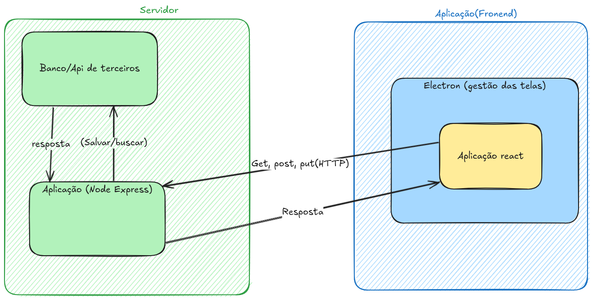

# 🧑‍💻 Aula Fullstack: React + Electron-Vite & Express + Sequelize

🚀 App desktop moderno com backend Node.js e frontend React com Electron-Vite

---

# 🧠 Arquitetura Geral


- Backend: Node.js, Express, Sequelize
- Frontend: React, Electron-Vite, Axios
- Comunicação: HTTP (GET, POST, PUT)

---




---

##### 📊 Arquitetura da Aplicação

🧠 Explicando o Diagrama
🟩 Lado esquerdo: Servidor (backend)
Node + Express: recebe requisições e responde

**Acessa banco local ou API externa**

🟦 Lado direito: Aplicação (frontend)
Electron: executa a aplicação como desktop

React: cuida da interface

Axios: comunica com o backend via HTTP

➡️ React envia requisições
⬅️ Backend responde com dados

---

# 🛠️ Parte 1: Backend com Node.js + Express + Sequelize

## ✨ Objetivo

Criar uma API REST para persistência de dados

---

## 📦 Setup do Projeto Backend

```bash
mkdir backend
cd backend
npm init -y
npm install express sequelize sqlite3 cors body-parser
npm install --save-dev nodemon
````

---

## 📁 Estrutura do Backend

```
backend/
├── config/database.js
├── models/usuario.js
├── routes/usuario.js
├── index.js
```

---

## 🔌 Sequelize - Conexão

```js
const { Sequelize } = require('sequelize');

const sequelize = new Sequelize({
  dialect: 'sqlite',
  storage: './database.sqlite'
});

module.exports = sequelize;
```

---

## 🧱 Modelo de Usuário

```js
const { DataTypes } = require('sequelize');
const sequelize = require('../config/database');

const Usuario = sequelize.define('Usuario', {
  nome: DataTypes.STRING,
  email: DataTypes.STRING
});

module.exports = Usuario;
```

---

## 🌐 Rotas REST com Express

```js
const express = require('express');
const router = express.Router();
const Usuario = require('../models/usuario');

router.get('/', async (req, res) => {
  const usuarios = await Usuario.findAll();
  res.json(usuarios);
});

router.post('/', async (req, res) => {
  const novoUsuario = await Usuario.create(req.body);
  res.json(novoUsuario);
});

module.exports = router;
```

---

## 🚀 Inicialização da API

```js
const express = require('express');
const cors = require('cors');
const bodyParser = require('body-parser');
const sequelize = require('./config/database');
const usuarioRoutes = require('./routes/usuario');

const app = express();
app.use(cors());
app.use(bodyParser.json());
app.use('/usuarios', usuarioRoutes);

sequelize.sync().then(() => {
  app.listen(3001, () => console.log('API no ar em http://localhost:3001'));
});
```

---

# ⚙️ Parte 2: Frontend com Electron-Vite + React

---

## 📦 Setup com Electron-Vite

```bash
npm create electron-vite@latest frontend
cd frontend
npm install
npm install axios
```

📝 Escolha o template `react` durante a criação!

---

## 📁 Estrutura do Projeto

```
frontend/
├── src/
│   ├── main/          # Código principal do Electron
│   └── renderer/      # Aplicação React
│       └── App.tsx
├── electron.vite.config.ts
├── package.json
```

---

## 🧠 Código React com Axios

```tsx
// src/renderer/App.tsx
import { useEffect, useState } from 'react'
import axios from 'axios'

function App() {
  const [usuarios, setUsuarios] = useState([])

  useEffect(() => {
    axios.get('http://localhost:3001/usuarios')
      .then(res => setUsuarios(res.data))
      .catch(console.error)
  }, [])

  return (
    <div>
      <h1>Usuários</h1>
      <ul>
        {usuarios.map((u: any) => (
          <li key={u.id}>{u.nome} - {u.email}</li>
        ))}
      </ul>
    </div>
  )
}

export default App
```

---

## 🚀 Rodando a Aplicação

### No Backend:

```bash
cd backend
npx nodemon index.js
```

### No Frontend (Electron-Vite):

```bash
cd frontend
npm run dev
```

---

# 🔁 Fluxo da Aplicação

1. React faz requisição HTTP via Axios
2. Node.js/Express responde com dados do Sequelize
3. Interface é atualizada em tempo real

---

# ✅ Conclusão

✅ Backend com Express + Sequelize
✅ Frontend desktop moderno com React + Electron-Vite
✅ Comunicação eficiente com Axios

---

# 💡 Dicas Extras

* Você pode usar `dotenv` para gerenciar configs de ambiente
* Sequelize funciona com vários bancos: SQLite, PostgreSQL, MySQL etc
* Electron-Vite suporta hot reload, TypeScript e build otimizado

---

# ❓ Perguntas?

---

