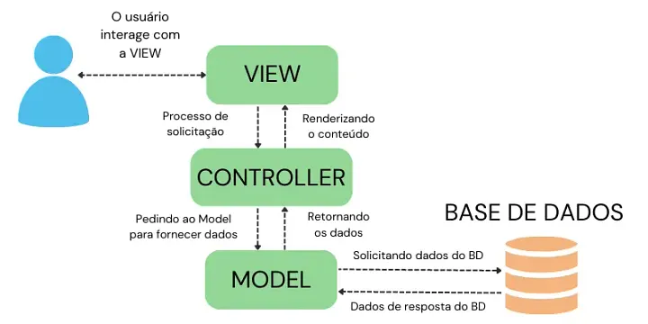

# Desvendando o Padrão MVC

## Uma abordagem aprofundada com aplicação prática em Express.js

---

### Agenda

1.  **Aprofundando no Conceito MVC**
    * O que é e por que usar?
    * Model, View, Controller: Responsabilidades detalhadas.
    * O Fluxo de Dados.
2.  **Mão na Massa com Express.js**
    * Estrutura do Projeto.
    * Implementando cada camada (M, V, C).
    * Juntando tudo e rodando a aplicação.
3.  **Benefícios e Conclusão**

---

## 1. Aprofundando no Conceito MVC

### O que é MVC?

**Model-View-Controller** não é um framework, é um **paradigma de design arquitetônico**.

Seu objetivo principal é a **Separação de Preocupações (Separation of Concerns)**.

* **Organização:** Divide um sistema complexo em partes menores e mais gerenciáveis.
* **Manutenção:** Facilita a localização de bugs e a adição de novas funcionalidades.
* **Escalabilidade:** Permite que a aplicação cresça de forma estruturada.

---

### O **Model**

É o **coração da lógica de negócio** e o gerenciador de dados da aplicação.

* **Acesso a Dados:** Única camada que se comunica com o banco de dados (SQL, NoSQL, etc.).
* **Lógica de Negócio:** Implementa as regras do sistema (cálculos, validações complexas).
* **Validação:** Garante que os dados a serem salvos são válidos.
* **Estado:** Mantém e gerencia o estado dos dados.

**O Model NÃO sabe sobre a interface do usuário ou requisições HTTP.**

---

### A **View**

É a **camada de apresentação**, responsável exclusivamente por exibir os dados ao usuário.

* **Renderização:** Apresenta os dados recebidos do Controller (gera HTML, JSON, etc.).
* **Interface do Usuário (UI):** É o que o usuário final vê e interage.
* **Passiva:** Deve ser o mais "burra" possível. Apenas exibe o que recebe, sem lógica de negócio.

**A View NÃO busca dados diretamente do Model.**

---

### O **Controller**

É o **maestro da orquestra**, atuando como um intermediário que conecta tudo.

* **Ponto de Entrada:** Recebe as requisições do usuário (geralmente via rotas).
* **Orquestração:** Processa a entrada do usuário, chama os métodos apropriados no **Model** para manipular os dados.
* **Conexão Model-View:** Após receber os dados do Model, seleciona a **View** correta e envia os dados para ela renderizar.

**O Controller NÃO deve conter lógica de negócio nem gerar a apresentação final.**

---

### O Fluxo de Dados no MVC

---


---

1.  O **Usuário** interage com a **View**.
2.  A **View** aciona uma requisição para o **Controller**.
3.  O **Controller** invoca o **Model** para buscar ou atualizar dados.
4.  O **Model** processa a lógica e notifica o **Controller** (retornando os dados).
5.  O **Controller** passa os dados para a **View**.
6.  A **View** renderiza a resposta e a exibe para o **Usuário**.

---

## 2. Mão na Massa: Lista de Livros com Express.js

Vamos construir uma aplicação web simples para gerenciar livros.

* **Framework:** Express.js
* **View Engine:** EJS (Embedded JavaScript)

---
### Estrutura de Pastas

Uma boa estrutura é a base para a separação de responsabilidades.

```

/livros-mvc
|-- /controllers
|   |-- livroController.js
|-- /models
|   |-- livroModel.js
|-- /views
|   |-- pages
|   |   |-- 404.ejs
|   |   |-- detalhe.ejs
|   |   |-- form.ejs
|   |   |-- lista.ejs
|   |-- partials
|   |   |-- footer.ejs
|   |   |-- header.ejs
|-- /routes
|   |-- livroRoutes.js
|-- package.json
|-- server.js

```

---
### O Model: `models/livroModel.js`

Usa um array em memória. **Zero dependências do Express.**

```javascript
// Usando um array em memória como nosso "banco de dados"
const livros = [
    { id: 1, titulo: "O Senhor dos Anéis", autor: "J.R.R. Tolkien" },
    { id: 2, titulo: "O Hobbit", autor: "J.R.R. Tolkien" },
];
let proximoId = 3;

export const livroModel = {
    getAll: () => livros,

    getById: (id) => livros.find(livro => livro.id === id),

    add: (novoLivro) => {
        const livroParaAdicionar = { id: proximoId++, ...novoLivro };
        livros.push(livroParaAdicionar);
        return livroParaAdicionar;
    }
};
````

---

### A View: `views/pages/lista.ejs`

Apenas recebe e exibe os dados em um loop.

```html
<%- include('../partials/header') %>

<h1>Lista de Livros</h1>
<ul>
    <% livros.forEach(livro => { %>
        <li>
            <%= livro.titulo %> - <%= livro.autor %>
            (<a href="/livros/<%= livro.id %>">Ver detalhes</a>)
        </li>
    <% }) %>
</ul>

<%- include('../partials/footer') %>
```

-----

### O Controller: `controllers/livroController.js`

Orquestra a busca de dados no Model e a renderização da View.

---

```javascript
import { livroModel } from '../models/livroModel.js';

export const livroController = {
    listarLivros: (req, res) => {
        const livros = livroModel.getAll();
        res.render('pages/lista', {
            tituloPagina: 'Minha Biblioteca',
            livros: livros
        });
    },

    detalharLivro: (req, res) => {
        const id = parseInt(req.params.id);
        const livro = livroModel.getById(id);
        res.render('pages/detalhe', {
            tituloPagina: livro ? livro.titulo : 'Livro não Encontrado',
            livro: livro
        });
    },
    // ...outros métodos (adicionar, etc)
};
```

-----

### As Rotas: `routes/livroRoutes.js`

Mapeia as URLs para as ações do Controller.

---

```javascript
import express from 'express';
import { livroController } from '../controllers/livroController.js';

const router = express.Router();

// GET /livros/
router.get('/', livroController.listarLivros);

// GET /livros/123
router.get('/:id', livroController.detalharLivro);

// GET /livros/novo
router.get('/novo', livroController.mostrarFormulario);

// POST /livros/novo
router.post('/novo', livroController.adicionarLivro);

export default router;
```

-----

### O Servidor: `server.js`

Une todas as peças: configura o Express, as views, os middlewares e as rotas.

---

```javascript
import express from 'express';
import path from 'path';
import livroRoutes from './routes/livroRoutes.js';

const app = express();
const PORT = 3000;

// Configurar o View Engine (EJS)
app.set('view engine', 'ejs');
app.set('views', 'views');

// Middleware para parsear o corpo de requisições POST
app.use(express.urlencoded({ extended: true }));

// Usar as rotas de livros
app.use('/livros', livroRoutes);

app.listen(PORT, () => {
    console.log(`Servidor rodando em http://localhost:${PORT}`);
});
```

-----

## Benefícios e Conclusão

  * **Código Limpo:** Cada parte tem sua responsabilidade, tornando o código mais legível.
  * **Testabilidade:** É mais fácil testar a lógica de negócio (Model) de forma isolada.
  * **Desenvolvimento Paralelo:** Equipes de frontend e backend podem trabalhar com mais independência.
  * **Flexibilidade:** É possível trocar a View (ex: de EJS para React) sem alterar o Model.

**Adotar o MVC é investir na saúde e longevidade do seu projeto.**

-----

# Perguntas?
https://docs.google.com/forms/d/e/1FAIpQLSdzg8ZV89InZ8F0MyexF5ecsdZWfdYJEe2P8fh_YMfJJzd0YA/viewform?usp=dialog
