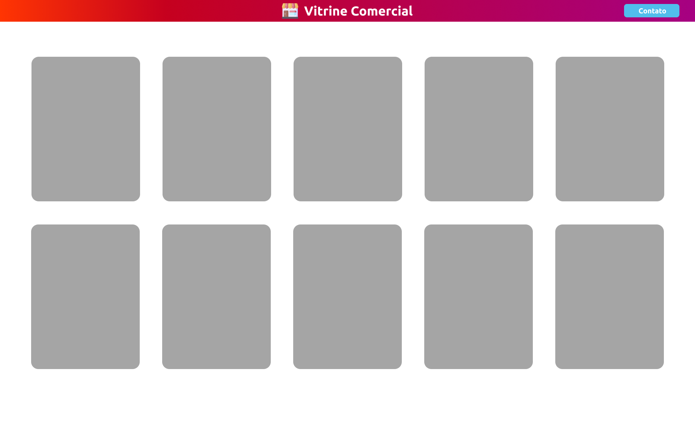

# Introdução ao HTML e CSS

- **HTML (HyperText Markup Language)**: Linguagem de marcação utilizada para estruturar o conteúdo da web.
- **CSS (Cascading Style Sheets)**: Linguagem de estilo utilizada para definir a apresentação visual de documentos HTML.

---

# História do HTML

- **1991**: Primeira versão do HTML desenvolvida por Tim Berners-Lee.
- **1995**: Lançamento do HTML 2.0.
- **1997**: HTML 4.0 e o início do CSS.
- **2014**: Lançamento do HTML5 com novas funcionalidades.

---

# Evolução do CSS

## CSS1 (1996)

- **Introdução**: Lançado em 1996 pelo W3C, o CSS1 foi a primeira versão oficial.
- **Funcionalidades**:
  - Definição de cores, fontes, e espaçamento.
  - Layout simples e suporte limitado a navegadores.

---

## CSS2 (1998)

- **Expansão**: Introduzido em 1998, trouxe suporte a media types e posicionamento de elementos.
- **Funcionalidades**:
  - Layouts mais complexos com `position`, `z-index`.
  - Suporte para impressão (`@media print`).
  - Suporte a fontes de diferentes tipos (`@font-face`).

---
## CSS2.1 (2004)

- **Correções e Melhorias**: Uma atualização do CSS2 que corrigiu bugs e tornou-se a base para o desenvolvimento moderno de CSS.
- **Funcionalidades**:
  - Melhoria na interoperabilidade entre navegadores.
  - Estabilização das funcionalidades existentes.

---

## CSS3 (2011)

- **Modularização**: Lançado em módulos, permitindo atualizações independentes e introdução de novas funcionalidades.
- **Funcionalidades**:
  - **Layout**: Flexbox, Grid Layout.
  - **Efeitos visuais**: Transições, animações, sombras, bordas arredondadas.
  - **Novos seletores**: Pseudo-classes avançadas como `:nth-child`.
---
## CSS4 (Futuro)

- **Estado Atual**: O termo "CSS4" é mais uma ideia do que uma especificação oficial. O CSS continua a evoluir por meio de módulos.
- **Novos Recursos**:
  - **Container Queries**: Adaptar o estilo com base no tamanho do contêiner.
  - **Novos Seletores**: Pseudo-classes e aprimoramentos para layouts responsivos.

---

### Estrutura Básica de um Documento HTML

```html
<!DOCTYPE html>
<html lang="pt-BR">
<head>
  <meta charset="UTF-8">
  <title>Título da Página</title>
</head>
<body>
  <h1>Olá, Mundo!</h1>
  <p>Este é um exemplo básico de HTML.</p>
</body>
</html>
```

---
- `<!DOCTYPE html>`: Define o tipo de documento.
- `<html>`: Elemento raiz que contém todo o conteúdo HTML.
- `<head>`: Contém metadados e links para recursos.
- `<body>`: Contém o conteúdo visível da página.

---

## Introdução ao CSS
- **Seletores:** Identificam quais elementos HTML serão estilizados.
- **Propriedades:** Definem aspectos como cor, fonte, layout, etc.
- **Cascata:** Regras CSS são aplicadas de cima para baixo.

---

```css
body {
  background-color: #f0f0f0;
  font-family: Arial, sans-serif;
}
h1 {
  color: #333;
}
.classe {
  width: 100%;
}
#id{
  height: 100vh;
}
```

---

# Bora praticar

Hoje vamos começar construir um layout do zero
- [Figma](https://www.figma.com/design/UPpp2v5BuMXQm1e2gE6jjo/Vitrine-Comercial---aula?t=FvVngHFP5Ag5Lx2w-1)
- [Repositório](https://github.com/ADS-Unipar/vitrine)



