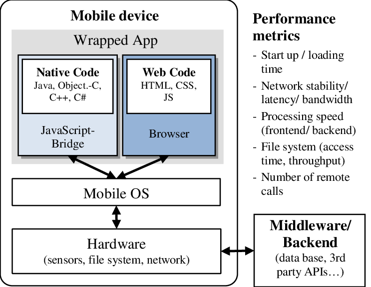
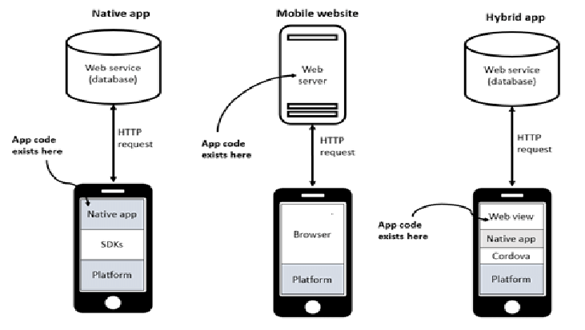
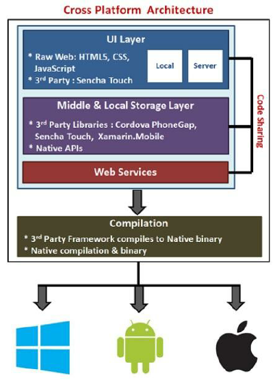

# 📱 Aula Completa  
## Introdução ao Desenvolvimento Mobile Multiplataforma

---

# 🎯 Objetivos da Aula

Ao final desta aula, o aluno será capaz de:

- Compreender a evolução do desenvolvimento mobile
- Diferenciar aplicações **nativas, híbridas e multiplataforma**
- Entender a **arquitetura do React Native**
- Utilizar conceitos de **JavaScript moderno (ES6+)**
- Compreender os fundamentos do **TypeScript**

---

# 1️⃣ Introdução ao Desenvolvimento Mobile

O desenvolvimento mobile envolve a criação de aplicações para:

- Smartphones  
- Tablets  

---

## 📲 Principais Sistemas Operacionais

- **Android**
- **iOS**

---

## 🧠 Desenvolvimento Tradicional

Cada sistema exigia uma linguagem específica:

- Android → Java / Kotlin  
- iOS → Objective-C / Swift  

Isso gerava:

- Duas equipes
- Dois códigos
- Maior custo

---

## 🚀 Evolução

Com o avanço das tecnologias surgiram soluções que permitem:

- Uma única base de código
- Execução em múltiplas plataformas
- Redução de custo e tempo

---

# 2️⃣ Histórico do Desenvolvimento Mobile

---

# 📌 1ª Fase – Aplicações Nativas (2008 – 2013)


---


---

Com o lançamento do:

- iPhone (2007)
- Google Android (2008)

Aplicativos eram desenvolvidos exclusivamente de forma **nativa**.

---

## Características

✔ Alto desempenho  
✔ Melhor integração com hardware  
❌ Alto custo  
❌ Código duplicado  

---

# 📌 2ª Fase – Aplicações Híbridas (2013 – 2016)

---


---


---





---

Frameworks como:

- Apache Cordova
- Ionic

Permitiram criar apps usando HTML, CSS e JavaScript.

---

## Funcionamento

Aplicações web rodavam dentro de um **WebView**.

---

## Vantagens

✔ Código único  
✔ Desenvolvimento rápido  

## Desvantagens

❌ Performance inferior  
❌ Experiência menos fluida  

---

# 📌 3ª Fase – Multiplataforma Moderna (2016 – Atual)
---


---


---


--- 



---

Surge o:

- React Native (2015)
- Flutter (2017)

Agora o código é compartilhado, mas os componentes são **renderizados como nativos**.

---

## Benefícios

✔ Melhor performance  
✔ Código reaproveitável  
✔ Comunidade ativa  

---

# 3️⃣ Nativa vs Híbrida vs Multiplataforma

| Característica                   | Nativa       | Híbrida     | Multiplataforma |
|----------------------------------|--------------|-------------|-----------------|
| Linguagem                        | Swift/Kotlin | HTML/CSS/JS | JS/Dart         |
| Performance                      | ⭐⭐⭐⭐⭐        | ⭐⭐          | ⭐⭐⭐⭐            |
| Código único                     | ❌            | ✔           | ✔               |
| Acesso a recursos do dispositivo | Total        | Limitado    | Alto            |
| Custo                            | Alto         | Médio       | Baixo           |

---

# 🔎 Comparação Visual

### 🟢 Nativa  
App → Código específico → Sistema operacional  

### 🟡 Híbrida  
App → WebView → Sistema operacional  

### 🔵 Multiplataforma  
App → Framework → Componentes Nativos → Sistema operacional  

---

# 4️⃣ Arquitetura do React Native


---

O React Native utiliza três partes principais:

## 📌 1. Thread JavaScript  
Onde roda a lógica da aplicação.

## 📌 2. Bridge  
Comunicação entre:
- Código JavaScript
- Código Nativo

## 📌 3. Componentes Nativos  
Elementos reais da interface (Button, View, Text).

---

## 🧠 Fluxo Simplificado

1. Usuário interage  
2. Evento vai para o JavaScript  
3. JavaScript processa  
4. Bridge comunica com o código nativo  
5. Interface atualiza  

---

# 🆕 Nova Arquitetura

Fabric + JSI

✔ Melhor performance  
✔ Comunicação síncrona  
✔ Renderização otimizada  

---

# 5️⃣ JavaScript Moderno (ES6+)

---

## let e const

```javascript
let idade = 20;
const nome = "Allan";
```

---

## Arrow Functions

```javascript
const soma = (a, b) => a + b;
```

---

## Desestruturação

```javascript
const usuario = { nome: "Ana", idade: 25 };
const { nome, idade } = usuario;
```

---

## Template Strings

```javascript
console.log(`Olá, ${nome}`);
```

---

## Spread Operator

```javascript
const numeros = [1,2,3];
const novos = [...numeros, 4];
```

---

## Módulos

```javascript
export default function App() {}
import App from "./App";
```

---

# 6️⃣ TypeScript – Introdução

TypeScript é um **superset do JavaScript** criado pela Microsoft.

---

## Benefícios

✔ Tipagem estática  
✔ Melhor organização  
✔ Detecção de erros em tempo de desenvolvimento  

---

## JavaScript

```javascript
function soma(a, b) {
  return a + b;
}
```

---

## TypeScript

```typescript
function soma(a: number, b: number): number {
  return a + b;
}
```

---

## Interface

```typescript
interface Usuario {
  nome: string;
  idade: number;
}
```

---

## Vantagens no React Native

✔ Autocomplete  
✔ Refatoração segura  
✔ Código mais escalável  

---

# 7️⃣ Atividade Prática

### 🎯 Criar app simples

- Exibir texto  
- Botão  
- Alterar texto ao clicar  

---

### 🎯 Converter para TypeScript

- Tipar props  
- Tipar estados  
- Tipar funções  

---

# 8️⃣ Conclusão

O desenvolvimento mobile evoluiu:

📌 Nativo → Híbrido → Multiplataforma moderno  

React Native permite:

- Código único
- Performance próxima da nativa
- Grande comunidade

---

# Material Complementar

- [CURSO DE TYPESCRIPT para INICIANTES | Aprenda Typescript na Prática](https://www.youtube.com/watch?v=QoqDr4H2G8U)

- [React Native em 2026: guia prático e completo para começar do zero](https://www.youtube.com/watch?v=7uGjAMhI8G4)

- [DOC React Native](https://reactnative.dev/docs/getting-started)

- https://www.typescriptlang.org/docs/handbook/typescript-in-5-minutes.html 