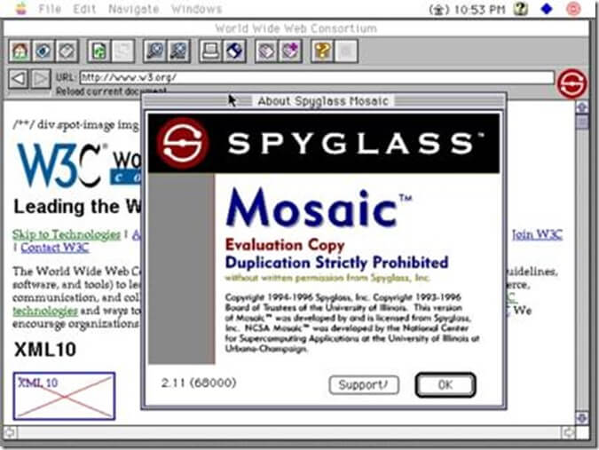

# A Evolução do Frontend

---

# ALLAN DA SILVA

* Marido da Regiane
* Pai do Davi
* Motoqueiro
* Professor na Unipar
* Desenvolvedor na Hostgator

---

##  A Criação da Internet (1960-1980)
* **1969**: ARPANET, primeiro embrião da internet, criada pelo Departamento de Defesa dos EUA.  
  <!-- A ARPANET foi criada para interligar computadores de instituições de pesquisa e militares. -->
* **1983**: Protocolo **TCP/IP** estabelecido, permitindo comunicação entre redes diferentes.  
  <!-- Vinton Cerf e Bob Kahn são os principais responsáveis pelo desenvolvimento do TCP/IP. -->
---
## Primeiro Site (1980-1990)

* **1989**: Tim Berners-Lee propõe a **World Wide Web**, um sistema de hipertexto global.  
  <!-- Tim Berners-Lee trabalhava no CERN e buscava uma forma de compartilhar informações científicas. -->
* **1991**: Primeira página web criada, utilizando **HTML básico**.  
  <!-- A primeira página foi hospedada no servidor do CERN e explicava o conceito da Web. -->

---

## Primeiras Versões do HTML e a Era Estática (1991-1995)
* **1993**: Lançamento do **Mosaic**, primeiro navegador gráfico popular, permitindo imagens em páginas web.  
  <!-- Criado por Marc Andreessen e Eric Bina, o Mosaic tornou a web mais acessível ao público. -->
* **1994**: Fundação do **W3C** (World Wide Web Consortium) por Tim Berners-Lee, para padronizar tecnologias web.  
  <!-- O W3C foi criado para evitar fragmentação na web e promover padrões abertos. -->
* **1995**: Lançamento do **HTML 2.0**, formalizando elementos básicos como formulários e tabelas.  
  <!-- HTML 2.0 foi o primeiro padrão oficial do W3C, consolidando recursos essenciais. -->

---

## Guerra dos Navegadores e o Monopólio da Microsoft (1995-2000)
* **Netscape Navigator vs. Internet Explorer (IE)**: Concorrência feroz para dominar o mercado de navegadores.  
  <!-- A Netscape dominava o mercado até a Microsoft integrar o IE ao Windows. -->
* **Microsoft inclui o IE no Windows**, prejudicando concorrência e iniciando disputas antitruste.  
  <!-- A Microsoft enfrentou processos antitruste nos EUA por práticas monopolistas. -->
---
## Guerra dos Navegadores e o Monopólio da Microsoft (1995-2000)

* **Lançamento do FrontPage e IIS (Internet Information Services)** pela Microsoft, incentivando o uso de tecnologias proprietárias.  
  <!-- O FrontPage facilitava a criação de sites, mas gerava código não padronizado. -->
* **1995**: Introdução do **JavaScript** pela Netscape, permitindo interatividade nas páginas.  
  <!-- Brendan Eich criou o JavaScript em apenas 10 dias na Netscape. -->
* **1996**: Lançamento do **CSS 1**, separando estilo e estrutura do HTML.  
  <!-- Criado pelo W3C, o CSS trouxe flexibilidade para design na web. -->

---

## O Surgimento do Backend Dinâmico (1995-2000)
* **1993**: Surgimento do **CGI (Common Gateway Interface)**, permitindo páginas dinâmicas via scripts.  
  <!-- CGI permitiu servidores executarem programas para gerar páginas dinâmicas. -->
* **1995**: **Perl** cresce como alternativa para desenvolvimento dinâmico na web.  
  <!-- Perl era popular por sua flexibilidade e eficiência em manipulação de texto. -->
* **1995**: Criação do **PHP** e do **Java Servlet**, possibilitando backends mais eficientes.  
  <!-- Rasmus Lerdorf criou o PHP para gerenciar seu site pessoal. -->

---

## Flash e a Primeira Revolução da Web (1996-2007)
* **1996**: Lançamento do **Macromedia Flash**, permitindo animações interativas na web.  
  <!-- Flash foi criado por Jonathan Gay e popularizado pela Macromedia. -->
* **1999**: **CSS 2** é lançado, introduzindo **posicionamento absoluto e relativo**.  
  <!-- CSS 2 trouxe maior controle sobre layout e estilos de páginas. -->
---

## Flash e a Primeira Revolução da Web (1996-2007)
* **2000**: Flash ganha suporte para **interatividade complexa e áudio/vídeo**.  
  <!-- Flash tornou possível criar jogos e experiências interativas na web. -->
* **2004**: **HTML 4.01 e XHTML** tentam padronizar a web, mas geram resistência por sua rigidez.  
  <!-- XHTML tentou tornar o HTML mais estruturado, mas não foi amplamente adotado. -->

---

## O Boom dos Frameworks e Bibliotecas (2006-2012)

* **2005**: Lançamento do **Ruby on Rails**, popularizando o modelo **MVC** e a produtividade no backend.  
  <!-- David Heinemeier Hansson criou o Rails para acelerar o desenvolvimento de aplicações. -->
* **Frameworks PHP** como **Zend Framework** surgem inspirados no Rails.  
  <!-- Laravel, criado por Taylor Otwell, trouxe recursos modernos ao PHP. -->

* **2006**: Surgimento do **jQuery**, simplificando a manipulação do DOM e requisições AJAX.  
  <!-- John Resig criou o jQuery para facilitar o desenvolvimento web. -->
---
* **2008**: **CSS3** introduz novas propriedades como gradientes, sombras e transições.  
  <!-- CSS3 trouxe mais controle estético sem necessidade de imagens extras. -->

---

## A Era dos Dispositivos Móveis e APIs Web (2010-presente)

* **2010**: **HTML5** lançado, trazendo novas APIs para gráficos, armazenamento e multimídia.  
  <!-- HTML5 eliminou a necessidade de Flash e trouxe padronização. -->
* **2011**: **CSS3** se torna padrão, permitindo designs mais flexíveis e modernos.  
  <!-- CSS3 unificou recursos antes dependentes de hacks. -->

---
## Evolução JS e Novas Bibliotecas e Frameworks JS  

* **2013**: **AngularJS e React** revolucionam o frontend com a abordagem de componentes e SPA.  
  <!-- O React foi criado pelo Facebook para melhorar a performance da UI. -->
* **2015**: **ECMAScript 6 (ES6)** traz melhorias como arrow functions, promises e classes.  
  <!-- ES6 trouxe melhorias para a escrita e manutenção do código JavaScript. -->

---

## Responsividade e a Morte do Flash

* **2010**: O conceito **Mobile First** ganha força com a ascensão dos smartphones.  
  <!-- Ethan Marcotte popularizou o termo "Responsive Web Design". -->
* **2015**: O Google começa a priorizar sites responsivos em seus rankings de busca.  
  <!-- Mobile-first se tornou obrigatório para SEO. -->
* **2020**: O **Flash é oficialmente desativado**, marcando o fim de uma era de animações pesadas e fechadas.  
  <!-- Flash se tornou obsoleto devido a problemas de segurança e falta de suporte. -->

---

## Presente - Voltamos a ter frontend no servidor

* **2016:**  Lançamento do NextJS e NuxtJS mercado, focando em SSR (Server-Side Rendering) e SSG (Static Site Generation).

* **2020s:** Astro, Remix e outros frameworks "Islands Architecture" estão ganhando espaço, permitindo carregamento mais eficiente de componentes.

---

## O Futuro/Presente do Frontend
* **WebAssembly** permite execução de código de alto desempenho diretamente no navegador.  
* **Web Components** possibilitam reuso de componentes nativos entre frameworks diferentes.  
* **Integração de IA** para desenvolvimento assistido e automação de código.  
* **Micro Frontend** Ideia se inspira na arquitetura de microservices, mas aplicada ao frontend.
---

# Uma imagem para traduzir um pouco do eco sistema frontend até 2019
---

https://raw.githubusercontent.com/ManzDev/frontend-evolution/refs/heads/master/frontend-evolution.png

---

### *A Web continua evoluindo e o frontend segue cada vez mais dinâmico!*
