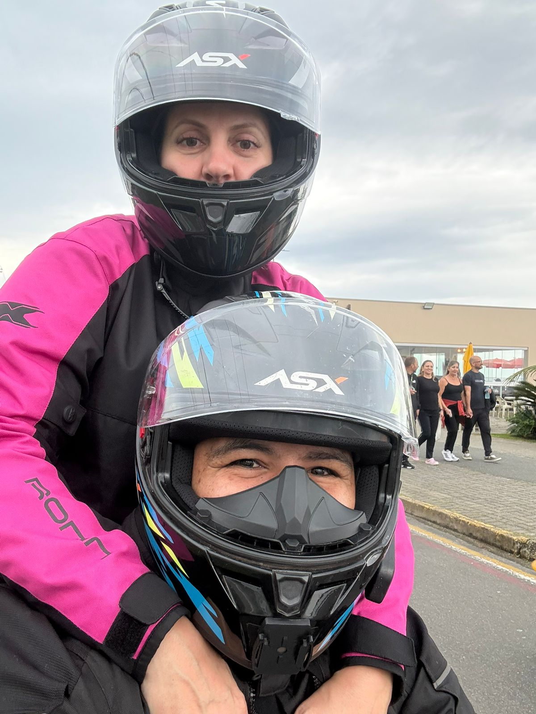

# 🚀 LinkedIn na Prática
## Para quem está começando (Ensino Médio)

---


# 👋 Quem ta falando?

## Allan da Silva
- Professor
- Tech Lead na TOT System
- Especialista em desenvolvimento Web/Mobile
- 13 anos de carreira em desenvolvimento de software
- Apaixonado por viagens de moto 

---

# 🎯 Objetivo

- Entender o LinkedIn
- Criar um perfil básico
- Aprender a se destacar
- Descobrir oportunidades

---


# 💡 Por que usar LinkedIn?

- Conseguir estágio
- Aprender com outras pessoas
- Mostrar o que você sabe
- Fazer contatos

---

# ⚠️ Erro comum

- Criar perfil e abandonar
- Só entrar quando precisa de emprego

👉 Isso não funciona

---

# 🧠 Como funciona

- É uma rede social
- Pessoas postam conteúdo
- Quem aparece mais, tem mais oportunidades

---

# 🔎 Buscar vagas (jeito certo)

## Erro comum

`trabalho`

`emprego`

---

# ✅ Forma correta

- Ser específico

Exemplo:

`estágio administrativo`

`jovem aprendiz`

---

# 🎯 Filtros importantes

- Últimas 24h
- Cidade / remoto

👉 Vaga antiga já foi preenchida

---

# 💻 Exemplos

```
estágio TI
```

```
jovem aprendiz administrativo
```

---

# 🕵️ Vagas escondidas

Buscar em POSTS

```
contratando estagiário
```

👉 Muitas vagas estão aqui

---

# ⚡ Rotina simples

- 5 a 10 min por dia
- Buscar vagas
- Se candidatar

---

# 👤 Seu perfil

👉 Pense como seu cartão digital

---

# 📸 Foto

- Rosto visível
- Fundo simples
- Boa iluminação

---

# 🧩 Título (headline)

❌ Estudante

✅ Estudante | Interesse em TI | Buscando estágio

---

# 📝 Sobre você

- Quem você é
- O que gosta
- O que quer aprender

---

# 💼 Experiência

Pode incluir:

- Trabalhos escolares
- Projetos
- Cursos

---

# 🧪 Dinâmica

👉 Ajustar título agora

---

# ✍️ Postar conteúdo

Você pode falar sobre:

- O que está aprendendo
- Curso que fez
- Dificuldades

---

# 🧱 Post simples

1. O que aprendi
2. Como foi
3. O que achei

---

# 📅 Frequência

1 a 2x por semana já ajuda

---

# 🧪 Dinâmica

👉 Escreva um post simples

---

# 🤝 Networking

- Seguir pessoas
- Curtir e comentar

---

# 💬 Exemplo

"Gostei do seu post, me ajudou a entender melhor"

---

# 📌 Desafio (7 dias)

- Criar ou melhorar perfil
- Fazer 1 post
- Interagir todo dia

---

# 💡 Mensagem final

> Você não precisa ser especialista para começar

---

# ❓ Perguntas

Dúvidas?
