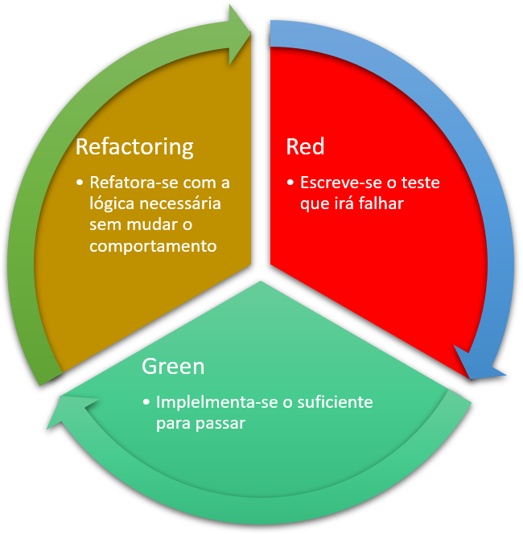

# TDD com React e Vitest

Uma introdução ao Desenvolvimento Orientado por Testes no React usando o Vitest.

---

## O que é TDD?

- **Test-Driven Development (TDD)** é uma técnica de desenvolvimento onde os testes são escritos antes do código funcional.
- Envolve um ciclo contínuo de **Red, Green, Refactor**.

### Benefícios do TDD:
- Melhor qualidade de código
- Manutenibilidade
- Código menos propenso a erros

---

## Origens do TDD

- **Criador**: Kent Beck, um dos fundadores do **Extreme Programming (XP)**.
- **Popularização**: Com o livro *Test-Driven Development: By Example*, publicado em 2002.
- **Primeiro uso**: A Chrysler Comprehensive Compensation (C3), onde TDD foi praticado em um projeto real como parte do XP.

### Motivação e Benefícios do TDD
- **Manutenibilidade**: Facilita refatorações seguras.
- **Qualidade**: Previne erros e facilita detecção de problemas.
- **Documentação**: Os testes funcionam como uma documentação viva do sistema.

---

## O Ciclo do TDD



--- 

1. **Red** - Escreva um teste que falhe.
2. **Green** - Implemente o código necessário para passar no teste.
3. **Refactor** - Refatore o código para otimização e clareza.

---

## Ferramentas Utilizadas

### React
- Biblioteca para construção de interfaces de usuário.

### Vitest
- Framework de testes para JavaScript, rápido e ideal para aplicações com Vite.

---

## Implementando TDD no React com Vitest

### Passo 1: Configurando o Vitest
- Instale o Vitest: `npm install vitest`
- Configure o ambiente de testes no projeto.

### Passo 2: Escrevendo o primeiro teste
```javascript
import { render } from '@testing-library/react';
import MyComponent from './MyComponent';

test('exibe o texto correto', () => {
  render(<MyComponent />);
  expect(screen.getByText(/texto esperado/i)).toBeInTheDocument();
});
```

---

## Exemplo Prático: Criando um Componente com TDD

### Passo 1: Escrevendo o teste

```javascript
test('deve exibir o botão de envio', () => {
  render(<SubmitButton />);
  expect(screen.getByRole('button', { name: /enviar/i })).toBeInTheDocument();
});
```

### Passo 2: Implementando o código para passar no teste

```javascript
const SubmitButton = () => <button>Enviar</button>;
```

---

## Conclusão

- TDD melhora a confiabilidade do código.
- React e Vitest formam uma combinação poderosa para desenvolvimento e testes frontend.

---

# Obrigado!
Dúvidas?
