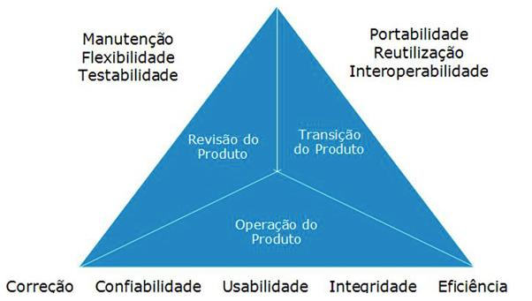

# Qualidade de Software

## Modelos de Qualidade de Software
#### McCall
#### ISO/IEC 25010

---

## Modelo de Qualidade de Software de McCall

- **Definição**: Este modelo foi desenvolvido por James McCall e é um dos primeiros modelos de qualidade de software. Ele considera a qualidade de software em termos de várias características que afetam o valor para o usuário final.

---

---
### Características Principais

  - **Correção**: Grau em que o software atende aos requisitos especificados.
    - *Exemplo*: Um sistema de faturamento que corretamente calcula e emite faturas de acordo com os critérios especificados.
  - **Confiabilidade**: Capacidade do software de manter seu desempenho sob condições especificadas por um período de tempo.
    - *Exemplo*: Um software de monitoramento de servidores que continua a operar corretamente mesmo durante picos de carga.
  - **Eficiência**: Uso eficiente dos recursos do sistema, como tempo de processamento e memória.
    - *Exemplo*: Um aplicativo de gráficos que gera visualizações de dados rapidamente sem consumir muita memória.
    
---

  - **Integridade**: Segurança do software e sua capacidade de proteger dados e recursos.
    - *Exemplo*: Um sistema bancário que protege transações e dados dos clientes contra acessos não autorizados.
  
  - **Usabilidade**: Facilidade de uso do software para o usuário final.
    - *Exemplo*: Um aplicativo de edição de fotos com uma interface intuitiva que permite aos usuários realizar edições facilmente.

- **Aplicação**:
  - Avaliação de produtos de software para garantir que atendem às necessidades dos usuários e se comportam conforme o esperado em condições normais e adversas.

---
## Implementação no Desenvolvimento 
  - **Correção**: Utilize **revisões de código** e **testes automatizados** desde o início do desenvolvimento para garantir que o software atenda aos requisitos especificados.
  - **Confiabilidade**: Implemente **testes de carga** e **testes de stress** para verificar o comportamento do software sob diferentes condições.

---
  - **Eficiência**: Realize **análise de desempenho** regularmente, utilizando ferramentas como *profilers* para identificar gargalos e otimizar o código.
  - **Integridade**: Aplique **práticas de segurança** como criptografia de dados e autenticação de usuários desde as primeiras fases do projeto.
  - **Usabilidade**: Integre **testes de usabilidade** e **feedback de usuários** em ciclos curtos de desenvolvimento para garantir que o produto seja fácil de usar.

---

## Modelo ISO/IEC 25010

- **Definição**: A ISO/IEC 25010 é uma atualização do modelo ISO/IEC 9126 e fornece uma estrutura mais detalhada para a avaliação da qualidade de software.
---

### Características Principais
  - **Funcionalidade**: Conjunto de funções que o software deve executar.
    - *Exemplo*: Um sistema de gerenciamento de inventário que deve permitir adicionar, editar e remover itens.
  - **Performance**: Eficiência do software em termos de resposta e processamento.
    - *Exemplo*: Um aplicativo de streaming que transmite vídeos sem atrasos.

---
  - **Compatibilidade**: Capacidade do software de operar com outros sistemas e em diferentes ambientes.
    - *Exemplo*: Um aplicativo que funciona em diferentes sistemas operacionais e navegadores.
  - **Usabilidade**: Facilidade com que os usuários podem aprender e operar o software.
    - *Exemplo*: Um sistema de CRM com uma interface amigável e fácil de navegar.

---
  - **Confiabilidade**: Capacidade de um sistema para manter o desempenho e não falhar.
    - *Exemplo*: Um servidor web que mantém alta disponibilidade e mínima interrupção.
  - **Segurança**: Proteção do software contra acesso não autorizado e dados sensíveis.
    - *Exemplo*: Um aplicativo de saúde que criptografa dados pessoais dos usuários.
  - **Manutenibilidade**: Facilidade com que o software pode ser modificado e atualizado.
    - *Exemplo*: Código bem documentado e modular que permite fácil atualização e correção de bugs.
---
  - **Portabilidade**: Facilidade com que o software pode ser transferido para diferentes ambientes.
    - *Exemplo*: Um aplicativo que pode ser instalado em diferentes plataformas de hardware e software.

- **Aplicação**:
  - Fornece uma visão abrangente da qualidade de software, cobrindo aspectos técnicos, funcionais e de usabilidade. Ideal para avaliações detalhadas e melhoria contínua.

---
## Implementação no Desenvolvimento 
  - **Funcionalidade**: Defina **critérios de aceitação claros** e use **testes de aceitação** para validar que as funcionalidades implementadas atendem aos requisitos.
  - **Performance**: Integre **testes de desempenho** contínuos durante o ciclo de desenvolvimento, utilizando ferramentas como *JMeter* ou *Gatling* para monitorar e otimizar o tempo de resposta.
  - **Compatibilidade**: Realize **testes de compatibilidade** para garantir que o software funcione em diferentes sistemas operacionais, navegadores e dispositivos.
---
  - **Usabilidade**: Aplique **métodos de design centrado no usuário**, como *personas* e **cenários de uso**, para guiar o desenvolvimento e melhorar a experiência do usuário.
  - **Confiabilidade**: Utilize **testes de resiliência** para verificar a capacidade do sistema de se recuperar de falhas e continuar operando corretamente.
---
  - **Segurança**: Implemente **testes de penetração** e **análise de vulnerabilidades** durante o desenvolvimento para identificar e corrigir problemas de segurança antes da implantação.
  - **Manutenibilidade**: Adote **práticas de codificação limpa** e **documentação abrangente** para facilitar a manutenção e evolução do software ao longo do tempo.
  - **Portabilidade**: Utilize **containers** ou **virtualização** para testar a portabilidade do software em diferentes ambientes e plataformas.

---

## Comparação Entre Modelos

- **Modelo de McCall**:
  - Foco em características como correção e integridade.
  - Ideal para uma visão geral do valor para o usuário final.

- **ISO/IEC 25010**:
  - Abrange uma gama completa de características de qualidade.
  - Ideal para avaliações detalhadas e melhorias abrangentes.

---

## Conclusão

- Cada modelo oferece uma perspectiva única sobre a qualidade de software e pode ser utilizado de acordo com os objetivos e requisitos específicos do projeto.
- A combinação de diferentes modelos pode fornecer uma visão mais completa e detalhada da qualidade do software.

---

## Perguntas para Discussão

1. **Como a aplicação de diferentes modelos de qualidade pode impactar o desenvolvimento e a manutenção de software?**

2. **Quais são os desafios de implementar o modelo ISO/IEC 25010 em um projeto de software complexo?**
 

3. **Como as características de qualidade descritas pelos modelos podem ser balanceadas em um projeto com recursos limitados?**
 

---

## Referências

- **Artigo da DevMedia**: [Qualidade de Software: Engenharia de Software](https://www.devmedia.com.br/qualidade-de-software-engenharia-de-software-29/18209)

---

