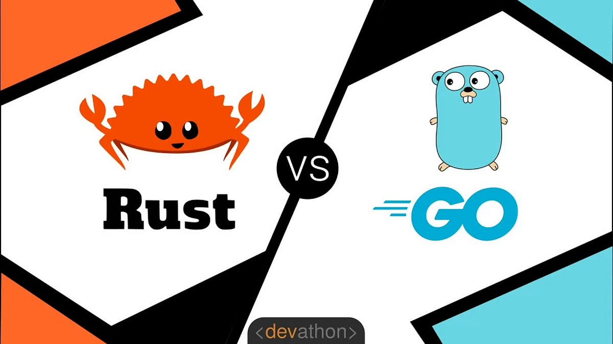

# Backend

---

O termo "backend" refere-se à parte de um sistema de software que lida com as operações que acontecem nos bastidores, longe da visão direta do usuário. É responsável pelo processamento, armazenamento e gerenciamento de dados, bem como pela execução de lógica de negócios. Em um sistema web, o backend geralmente consiste no servidor e no banco de dados.

---

#### Aqui estão algumas das principais responsabilidades do backend:

**Lógica de Negócios:** O backend executa a lógica de negócios do aplicativo. Isso inclui processamento de dados, validações, autenticação de usuários, autorização e outras operações que garantem que a aplicação funcione conforme esperado.

**Armazenamento de Dados:** O backend gerencia a persistência de dados. Isso envolve interações com bancos de dados para armazenar, recuperar e manipular informações de forma eficiente.

---

**Segurança:** A segurança é uma preocupação crítica no backend. Isso inclui a proteção contra ameaças como injeção de SQL, ataques de script entre sites (XSS), entre outros.

**Integração com Frontend:** O backend fornece APIs (Interfaces de Programação de Aplicações) que o frontend utiliza para enviar e receber dados. Isso permite a comunicação eficiente entre o frontend e o backend.

**Autenticação e Autorização:** Gerencia o processo de autenticação, verificando a identidade dos usuários, e a autorização, controlando as permissões de acesso aos recursos do sistema.

---

**Gerenciamento de Sessões:** Mantém o controle das sessões do usuário, permitindo a persistência de dados durante a interação do usuário com a aplicação.

**Desempenho e Escalabilidade:** O backend deve ser otimizado para garantir um desempenho eficiente e ser capaz de lidar com um número crescente de usuários conforme a aplicação se expande.

---

# Evolução do Backend

Vamos explorar as principais linguagens que moldaram a evolução do desenvolvimento do lado do servidor.

---

#### Anos 90 - CGI e Perl

- O Common Gateway Interface (CGI) foi a primeira abordagem para a criação de páginas dinâmicas.

- Perl era uma linguagem popular para scripts CGI.
Limitações em escalabilidade e desempenho.

---


#### Início dos anos 2000 - PHP e ASP
- PHP (Personal Home Page, posteriormente Hypertext Preprocessor) ganha popularidade.
- ASP (Active Server Pages) da Microsoft também em uso.
- Mais dinamismo, mas desafios em manutenção.

---

#### Meados dos anos 2000 - Ruby on Rails e Django

- Ruby on Rails e Django introduzem frameworks MVC para simplificar o desenvolvimento.
- Ênfase na convenção sobre configuração.
- Aumento da produtividade e popularização da arquitetura MVC.

---


#### 2009 - Node.js

- Node.js é introduzido por Ryan Dahl.
- Baseado no motor V8 do Google Chrome.
- Modelo assíncrono e não bloqueante, ideal para operações de I/O.

---

#### 2010s - Expansão do Ecossistema Node.js e Adoção de Java Spring


- Node.js cresce rapidamente com o NPM (Node Package Manager).
- Java Spring Framework ganha destaque, oferecendo uma abordagem robusta para desenvolvimento Java.

---

#### 2011s - Laravel e PHP volta com tudo

- Laravel é lançado por Taylor Otwell e rapidamente é adotado por uma garde parcela comunidade PHP gerando um grade debate sobre arquitetura no php.

---



#### 2015 - Go (Golang) e Rust


- Go é introduzido pela Google, focado em desempenho e simplicidade.
- Rust, desenvolvido pela Mozilla, oferece segurança de memória sem sacrificar o desempenho.

---


#### Atualidade - Serverless e Microsserviços

- Serverless architecture ganha destaque, removendo a necessidade de gerenciar servidores.
- Microsserviços continuam sendo uma abordagem popular para escalabilidade e manutenção.

---

# Porque vamos ver NodeJS

- Grandes empresas adotaram o Node.js: Netflix, LinkedIn, Uber, PayPal.
- [Comunidade ativa](https://nodebr.org/#/home): Conferências, meetups e colaboração aberta.
- Usa javascript 😄

---

## Bora por a mão na massa

- Vamos construir uma aplicação usando [express](https://expressjs.com/pt-br/)

- vamos iniciar um novo repositório (cre uma pasta com o nome `api-tasks` )

- abar ela no VScode

- abra o terminal e execute o seguinte comando
```sh
    npm init -y
```
---

- depois instale o express

```sh
    npm install express --save
```

- agora crie um arquivo chamado `index.js`

```sh
    touch index.js
```

---

- cole o codigo abaixo no arquivo

```js

const express = require('express');
const app = express();
const port = 3000;

// Rota padrão
app.get('/', (req, res) => {
    res.send('Bem-vindo ao Express.js!');
});

// Iniciar o servidor
app.listen(port, () => {
    console.log(`Servidor está rodando em http://localhost:${port}`);
});
```

---

- execute o comando

```sh
node index.js
```

e  pronto vc tem o primeiro servidor node de vocês funcionando